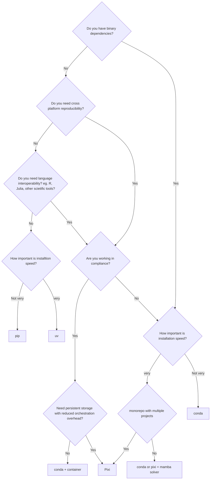

# Package Decision Tree

## About

<!-- <Main description>   -->

Trying to make sense of the packaging ecosystem and which package manager to use? This is a draft decision tree to help sort what works best for your scenario. This diagram was first created for my PyData Vermont 2025's [From Chaos to Confidence: Solving Python's Reproducibility Crisis](https://www.canva.com/design/DAG1xAsJ_5o/ovV5oLAakRgt3daa_d-p4A/edit?utm_content=DAG1xAsJ_5o&utm_campaign=designshare&utm_medium=link2&utm_source=sharebutton)

<!-- Decision Tree -->

### Flowchart [<a href="[https://mermaid.js.org/syntax/flowchart.html">docs</a> - <a href="https://mermaid.live/edit#pako:eNpNkMtqwzAQRX9FzKqFJK7t1km8KDQP6KJQSLOLvZhIY1tgS0GWmgbb_165IaFaiXvOFTPqgGtBkEJR6zOv0Fj2scsU8-ft8I5G5Gw6fe339GN7tnrYaafE45WvRsLW3Ya4bKVWwzVe_xU-FfVsc9hR62rLwvw_2591z7Y3FuUwgYZMg1L4ObrRzMBW1FAGqb8KKtCLGWRq8Ko7CbS0FdJqA2mBdUsTQGf110VxSK1xdJM2EkuDzd2qNQrypQ7s5TQuXcrW-ie5VoUsx9yZ2seVtac2DYIRz0ppK3eccd0ErRTjD1XfyyRIomSBUUzJPMaXOBb8GC4XRfQcFmL-FEYIwzD8AggvcHE](https://mermaid.live/edit#pako:eNp1U9tuGzkM_RVCL9vFOkYmdnzDokUbB03TbJIW6QJt3Ad6hvZoq8tA0jidtfPvpebiuEHrB9sidcjDw6OtSG1GYiZWyj6kOboAd_OFAf683s4tVLaEHDcES2nQVZBRQSYjk0ryrx7h6Ojl7tru4M2Lz91FBG0dgZe6UPxDAcoCHmTIQUsjNSpIrS4wyKVUMlQgvS_J_9n2jBVh95n8Dt6-uCJ0BnBpy_Cr_vA3KGm-wcsW_KYGn3W0DVEGqbPeQ6EwrKzT4KhwNivTtvnBBBdxgj8i8YCVNGuwRlX8FUs50Jjm0lAPjGX6JiVnfDMUOs4ESkPpqN8SOTuY4l2tDMbCrG4sHHLJjJz9j0FNjdQqRbhmGXrcqeKbsoBgoeEaJLOo72VytSJHJnR8wBeUypVMMV5q0UteVilVAGlAlyrIuAcmHZARznckL2qS85_UUmjWJa6JoYGcLchhKxTQug8fe3BZKok9sCEnB563EGJ7JmtV6weo5bx8LmccgAndViHncSi1vvKBdK1ojvLZaluO8wMh39dCxgEfrPsWh2tIdJx9DHEEPGoCMhvprNEsVjfwZV3santhH4DNaV1AVlJGHJNUqtaZBaXsaZAAG3LVDv65L2Txtalz1SSbxPV9uWnjb2P8_Lfl8bB-g3gXETfb1yxTXEGcK0rFc8QnwkKz0ToutQa32-u4Jt6Ll6we1_fBuriw2h-O2C6ct-xJ8sE1LS0zzQn3XW_3nv9wz7bIEP56ssfXwzt1z4_3t_K7bOM3e-z5oQp3W20Nv_rCti-9s11rc9-2vjsoexiJBT-1ZKyDghsyKY16ieCt2ux5nT9fzL8Nqk2_r9M3fIhn0RNrJzMxC66kntDkNMaj2MbsQrBZNC3EjP9mtELmvBAL88iwAs0Xa3WHdLZc52K2QuX5VBYZBppLXDvU-6iL3nVntjRBzEaTJKmriNlWfBez5KQ_Gg1Hk_HJZHo6np6MBj1RidnR4HjYn46no8Hx6XgyGU-T08ee-L_unPST6XA4mA6TJBkNBoPHH9285aU)">live editor</a>]

| Feature | Pixi | conda | pip | Poetry | uv |
|---------|------|-------|-----|--------|----|
|Installs Python |✅|✅ | | | |
|Multi-language|✅|✅| | | |
|Lock files|✅| | |✅|✅|
|Task Runner|✅ | | | | |
|Workspace Management |✅ | | |✅| ✅| 
|Foundation Governance| |✅|✅|✅| |
|Enterprise support| |✅| | | |

### Python Installation versus your Package Manager
Your `language interpreter` reads the source code, translates it and then executes it. CPython, Jython, IronPython, PyPy are all Python distributions that take the language and alter it for specific needs CPython is the default language and interpreter, Jython is in Java, IronPython is for Python to .NET, PyPy is for Just in Time compiling of your Python. Your `package manager` accesses the repository of packages needed for your project. This could be a Python package manager or a language agnostic one like `Pixi` and `conda`.

Your development environment creates a sandbox for your project. Many times this is connected to your virtual environment and the tool that youre using to create, update and distribute it. Your version control will track its progress over time, allowing you to go back in time.

### Developer Experience

#### Developer Package Velocity

PyPI is the first place many people will publish their packages. This leads to the ability to have a quick feedback loop with experimenting with new tools and what is in front of you. Be careful where you're getting your packages from! If you're pulling from PyPI, be sure to make sure they're from trusted sources. 

#### Lock files (Compliance)
A `lock file` is a file that records every single package, at exact versions, that was installed in your environment. This allows for fixed or pinned ranges that can help keep track of the drift and solving compatibility issues. Per project lock files ensure consistency. `Pixi` creates lockfiles by default. This explicit file allows for better support for cross platform dependencies.

Many times we're building quick and dirty projects for just your research scenario or hobby project, but if you're the position to be in a department and see many scenarios and share resources with peers it behoves to create a resilient pipeline. This may require the use of containers to keep architecture consistent across your peers' machines but that adds a learning curve for a team without DevOps background or established best practices for Docker or Vagrant containers. If you're looking for a more simple workflow without containers, cross platform compatibility and perhaps the perk of not worrying about penetrating your container for persistent storage, then `Pixi` and `conda` excel with cross architecture environments.

#### Multi language

Pip, uv, Poetry = Python Package Index
- Designed for Python packages only
- Assumes: Python already installed
- Manages: .py files, Python wheels
- Outside scope: R, Julia, Node.js, system tools

Conda, Pixi  = Anaconda dot org Package Repository
- Designed for any software
- Manages: Python, R, Julia, Node.js, system tools, compilers, libraries and conda format
- No assumption about what you're installing
- Language-agnostic architecture

#### Project versus global environments

 If you're experimenting, in different projects and are intersted in creating one environment that you can use all over your machine, all of the major tools have ways to do that: `conda` does this by default, `pixi global`, `uv-workon`, and `virtualenvwrapper` will provide this with `venv`. 

You may want to consider a global dependency if...
- Multiple projects use similar dependencies (pandas, numpy, etc.)
- shared-utils is used by all three
- Want to develop them together
- Don't want to duplicate environments 3-4 times

A project based workflow seen with Pixi, Poetry and uv all have taken a directory / file-structure first approach. Within the same directory as your project there will be declarative boilerplate files that indicate your environment preferences rather than stored in a specified global location. This limits you from being able to use the same environment with a different project. The ecosystem is moving toward project based structures. With some creativity, this can work for a mono-repo but may cause issues when requirements differ eg. data-pipeline uses numpy 1.24, ml-models uses 1.25, or give you more files to manage and thus makes it more difficult to keep everything in sync.

#### Task Runners

Common tasks people use task runners for:
- Documentation building - Many projects have a [testenv:docs] that builds Sphinx docs
- Linting and formatting - Running black, flake8, mypy, etc. in isolated envs
- Packaging/building - Creating source distributions or wheels
- Multiple Python versions - Running any command across Python 3.9, 3.10, 3.11, etc. to check compatibility
- CI/CD workflows - Orchestrating a series of different checks and builds

Pixi has a relatively simple task runner. If you need complex bash scripting with advanced features (conditionals, loops, complex piping), you might hit limitations. You'd typically need to call out to separate shell scripts for anything sophisticated like running tasks in parallel or tasks that are not environment bound (like Pixi). While Pixi aims for cross-platform support, writing tasks that work identically on Windows, macOS, and Linux can be tricky. You might need platform-specific task definitions or have to stick to very simple, portable commands. If you find you may outgrow Pixi's task runner, consider tools like Make, Just, or Task.

## Contributing

Feel free to create a PR to update this diagram! I look forward to hearing feedback and expanding the scope of this as new tools arise.

## Appreciation

> _Many thanks to the [conda-forge](https://conda-forge.org/), the organization building prolific open-source tooling for the conda ecosystem and [Prefix](https://prefix.dev/), the maintainers of [Pixi](https://pixi.sh/), projects for providing fantastic features and tools in the ecosystem!_
>
> Community-driven tooling would not be possible without volunteers.
>
> _Thank you to the growing list of [contributors](https://github.com/conda/conda/graphs/contributors) that brought the conda project this far!_

---

_This diagram was created by [Dawn Wages](https://dawnwages.info) for easier Python package decisions. Any concerns should be directed in the form a Pull Request to this repo._
